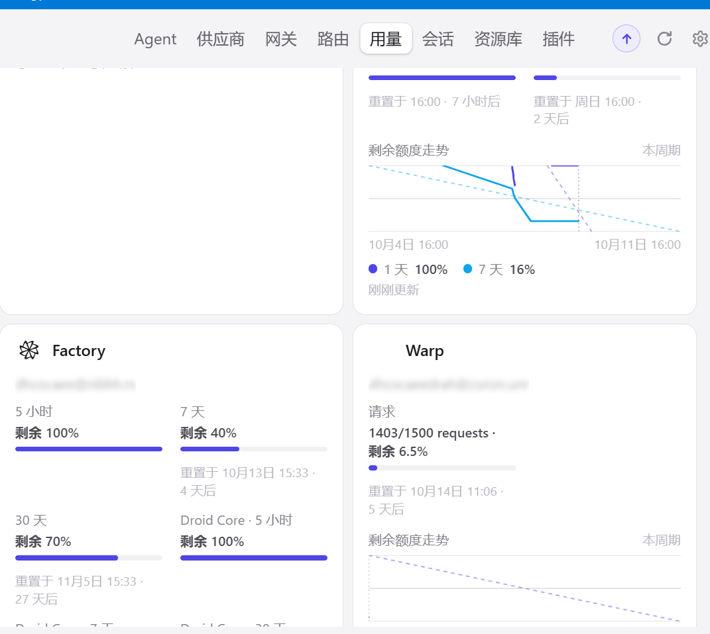

# Warp PR #57 verification — 2026-10-09

These are manually authorized real-account checks, separate from the isolated offline test suite. Credentials were read on their original host and were never copied between hosts or included in these artifacts. The existing anonymized Windows capture is included unchanged. The macOS desktop capture contains an email address, so sanitized JSON reports are provided instead.

## Windows

Native DPAPI login, 125 discovered models, non-streamed chat and a streamed `warp_verify` MCP call succeeded. The two requests increased the allowance counter by exactly two. The user also confirmed the Claude Code status changed from persistent `0% ctx` to `2% ctx` after the context-usage fix.

This capture shows `1403/1500 requests` and `6.5%` remaining. It was taken before the later macOS checks on the same account, so the counters are from different times.

## macOS

[Native login, chat, tool calls, history and allowance report](macos-live.json), captured with plugin revision `75c32d0`:

- Native Keychain sign-in and 125 discovered models.
- Non-streamed chat succeeded with HTTP 200.
- Streamed `warp_verify` tool call used a random code from the previous turn, index 0, `tool_calls` finish and `[DONE]`.
- The next turn recalled the original code and the synthetic tool result. The verification tool had no local side effects.
- These three requests changed the request counter from 1412/1500 to 1415/1500.

[Actual magpie `/v1/messages` gateway context report](macos-context.json), captured after the context fix in `ca3fe7f`:

- Both streamed and non-streamed real requests returned HTTP 200 and the expected answer.
- Input estimates were 14,015 and 14,017 tokens rather than zero, derived from the public Warp context-window fraction and advertised model window.
- These estimates are explicitly marked in the provider response. Exact counts take precedence when present. Public responses in these checks omitted output token counts, so `outputTokens: 0` is an availability limitation, not a measured zero-cost claim.

## Latest review regression checks

Head `33c86f524c93d192eefa90ca74b7a00b9603b03d` fixes the duplicate manual-token prompt with automatic OAuth and adds HTTP/2 pause/resume flow control.

- Windows and macOS: **118 package tests passed, 0 failed, 2,737 assertions** on each host. Temporary home and mocked network/native credential access; unexpected external requests and native credential subprocesses were blocked by the test preload.
- `bun scripts/check.mjs warp` and `git diff --check` passed.
- Actual upstream magpie plugin host over stdin/stdout RPC, with synthetic auth and mock transports: single-prompt OAuth login, discovery, limiting allowance, streaming/non-streaming, tools, context errors, quota diagnostics and output-token mapping passed.
- The HTTP/2 regression drains more than 8 MiB through repeated pauses/resumes and verifies every chunk arrives once and in order, plus cancellation/error cleanup while paused.

Linux credential paths have offline fixture coverage; **no Linux real-account validation has been performed**. No full repository test suite was run locally. First npm publication and CI approval remain with the upstream maintainers.
